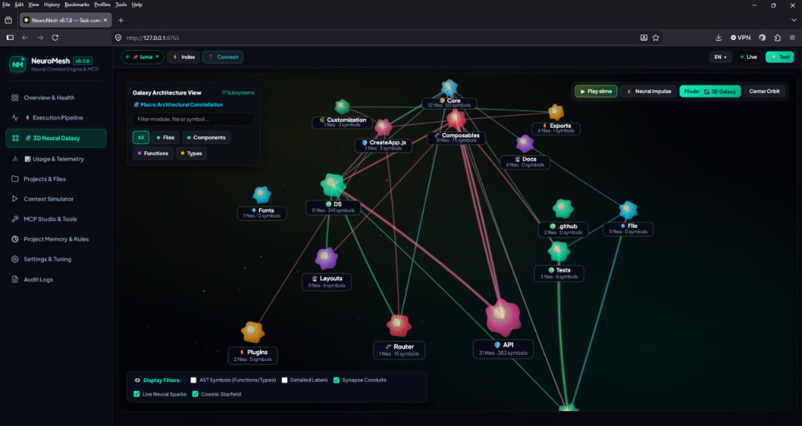
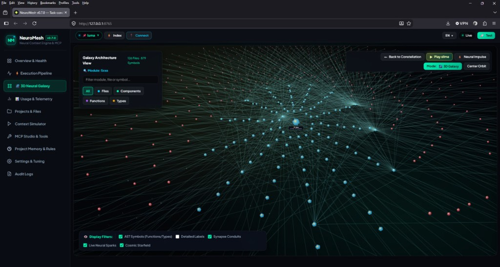
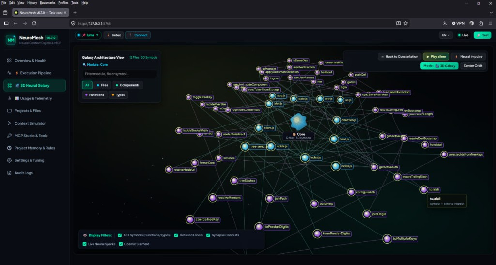

<div align="center">

# NeuroMesh

### Don’t delete the extra code. Fold it.

How does nature pack two metres of DNA into a nucleus without deleting a single letter?  
Not by throwing genes away — by **folding**.

NeuroMesh does the same thing to your repository: a neural graph in RAM, reversible one-line folds, and an evidence packet instead of three thousand-line files dumped into Cursor or Claude.

[](https://github.com/pinoox/neuromesh/releases/latest)
[](https://www.rust-lang.org/)
[](https://github.com/pinoox/neuromesh/actions/workflows/ci.yml)
[](https://modelcontextprotocol.io/)
[](LICENSE)

Local-first [MCP](https://modelcontextprotocol.io/) · Cursor · Codex · OpenCode · MiMo CLI · Antigravity · VS Code · Claude · Kilo · Trae · Windsurf · Zed

[The pain](#the-pain) · [The idea](#dont-delete-fold) · [Galaxy](#3d-neural-galaxy) · [Install](#install) · [Connect](#connect) · [Docs](docs/README.md) · [Site](https://pinoox.github.io/neuromesh/)

</div>

---

## The pain

You ask a simple question in a large project. The editor copies two or three **thousand-line files** and ships them to the model.

What you pay for:

1. **Tokens you never needed** — dollar cost on every turn  
2. **Seconds of fake loading** while the window fills with helpers you will not touch  
3. **Lost in the middle** — the model drowns in unrelated bodies and invents bugs

Today’s workarounds all leak in a different place:

| Approach | What goes wrong |
| :--- | :--- |
| Vector RAG | Chunks smash functions. The shape of the code disappears. |
| “Just attach the files” | The model sees everything and understands nothing. |
| A static code graph | Better *map* — then it still pastes **full files** into the prompt. |

NeuroMesh is the missing step: **route first, then fold.** The graph is for finding the path. The packet is what the model actually reads.

---

## Don’t delete. Fold.

Nature does not delete DNA to fit a nucleus. It **supercoils**.

NeuroMesh treats the syntax tree like a genetic strand in RAM:

- Functions you need stay **expressed** (exons) — real body, real lines  
- The rest collapse to a **one-line reversible intron**:

```c
/* [neuromesh:fold:fold_unused_helper_1 | 12 lines folded | fn unused_helper()] */
```

The agent still sees the *shape* of the file — signatures, imports, neighbors — without paying for every private helper. When a folded body is required, `neuromesh_expand_fold` unsplices it from a registry in memory. Nothing was deleted. Nothing needs a second grep of the disk.

> Structure stays. Tokens sleep. Wake a fold when you need it.

---

## Inspired by living systems

| Nature | In the engine | For the agent |
| :--- | :--- | :--- |
| **DNA supercoiling** | Genetic skeletonizer | Fold unused bodies; keep the map of the file |
| **Physarum (slime mold)** | Steiner / shortest connecting tissue | Don’t flood the prompt with the whole neighborhood — grow the cheapest path between seeds |
| **Synapses & STDP** | Pheromone edges + `record_feedback` | Paths you actually edited get stronger next time |
| **Cell membrane** | QualityGate | Tight by default; auth / payment tasks open the membrane |
| **Mycelium** | Hyphal prefetch | Warm the next hop before the second tool call |
| **Neural mesh** | Project graph in RAM | Files, functions, `Imports`, `Calls` — a nervous system, not a bag of strings |

The philosophy of the social pitch is right: **a graph in RAM, a short path, the rest dormant.** After seeds resolve, neighborhood Physarum grows tubes between them (under 20ms, skipped if the subgraph is huge). Fill still respects the token cap. `record_feedback` is how synapses change the next packet.

Play with the metaphors and the crates: [docs/nature.md](docs/nature.md).

---

## 3D Neural Galaxy

`neuromesh monitor` is the live mesh: subsystems as a constellation, then the file graph, then the symbols inside a module.

<p align="center">
  
</p>
<p align="center"><sub>Constellation — crates and subsystems</sub></p>

<p align="center">
  
</p>
<p align="center"><sub>3D galaxy — files and synapses; Play slime grows Physarum tubes</sub></p>

<p align="center">
  
</p>
<p align="center"><sub>Module zoom — files and AST symbols in one crate</sub></p>

Default URL: [http://127.0.0.1:8765](http://127.0.0.1:8765). Port: `neuromesh port`.

---

## How a turn actually goes


1. **Read the task** as written. `handle_tool_call` survives; it is not lowercased into mush.  
2. **Resolve on the mesh.** Edges exist when the target is unique. Ambiguous names stay sleepy — never a million fake links.  
3. **Ship seeds, grow the tube, fill the rest.** The files that own those symbols always go in. With two or more seeds, Physarum traces the cheapest connecting tissue on a neighborhood subgraph. Callees and synaptic neighbors fill a **real** budget (`balanced` = 5k extra tokens).  
4. **Splice.** Untargeted bodies become fold markers. Coverage tells you if a seed was missed — only then is Grep fair. Folds stay in the MCP session so the next tool can wake them.

Tell the agent ([full install guide](docs/agent-guide.md)):

```
get_context_packet(query / task_description / prompt / task)
  → neuromesh_expand_fold if a body is still folded
  → neuromesh_trace for callers
  → neuromesh_record_feedback after a good edit
```

**Seed engine** (how symbols are resolved before folding): default `keywords_expanded`; use `semantic_lite` for NL-heavy repos without client keywords:

```bash
neuromesh config seed-engine semantic_lite          # this repo (nm.config.json)
neuromesh config seed-engine keywords_expanded --global
```

### Modes (the membrane)

| Mode | Extra tokens on top of seeds | Feel |
| :--- | ---: | :--- |
| `max_savings` | 0 | Tiny, obvious edits |
| `balanced` | 5,000 | Default |
| `max_quality` | 16,000 | Refactors, auth, “don’t you dare miss it” |

Seeds are never truncated to fake a small packet.

---

## Install

**macOS / Linux**

```bash
curl -fsSL https://raw.githubusercontent.com/pinoox/neuromesh/main/install.sh | bash
```

**Windows**

```powershell
irm https://raw.githubusercontent.com/pinoox/neuromesh/main/install.ps1 | iex
```

```bash
# From source (needs rustup 1.80+; distro rustc 1.75 cannot parse this Cargo.lock)
git clone https://github.com/pinoox/neuromesh.git
cd neuromesh
cargo build --release --bin neuromesh

# Or Cargo
cargo install --git https://github.com/pinoox/neuromesh.git neuromesh-cli --bin neuromesh
```

```bash
neuromesh doctor
neuromesh connect    # write MCP configs for this repo (absolute binary, no PATH)
```

### Update / uninstall

Same installer **overwrites** the binary. Re-run the curl / `irm` command above (or `cargo install --force --git …`). Then `neuromesh -v` and restart the IDE so MCP does not keep an old process.

Two copies are common: installer vs Cargo.

| How you installed | Binary |
| :--- | :--- |
| `install.sh` | `~/.local/bin/neuromesh` |
| `install.ps1` | `%LOCALAPPDATA%\Programs\neuromesh\neuromesh.exe` (also copied to `~\.cargo\bin` if that folder exists) |
| `cargo install` | `~/.cargo/bin/neuromesh` |

`which neuromesh` / `where.exe neuromesh` shows which one PATH hits first. Delete the extra file, or `cargo uninstall neuromesh-cli` if Cargo owns it. Drop the `neuromesh` block from `.cursor/mcp.json` (and friends) if you are leaving MCP.

---

## Connect

Native **MCP stdio** — what Cursor, Claude, Codex, OpenCode, MiMo CLI, Antigravity, VS Code, Kilo Code, Trae, MiniMax, Windsurf, Cline, and Zed launch.

```bash
neuromesh connect           # merge NeuroMesh into project + installed-app configs
neuromesh connect --print   # copy-paste snippets only
```

That writes an **absolute** `command` (this binary) plus `args: ["mcp", "<workspace>"]` and `NEUROMESH_WORKSPACE`, so the agent does not need `neuromesh` on PATH.

**Manual (PATH required):** if `neuromesh` is on PATH, paste into Cursor MCP settings (`.cursor/mcp.json`). Always pass the **workspace path** as the second argument — `args: ["mcp"]` alone may index your home directory:

```json
{
  "mcpServers": {
    "neuromesh": {
      "command": "neuromesh",
      "args": ["mcp"]
    }
  }
}
```

Run this from your **project root** (or use `neuromesh connect`, which also pins the absolute binary path and workspace).

Details and other clients: [docs/mcp.md#manual](docs/mcp.md#manual).

| Client | Config |
| :--- | :--- |
| Cursor | `.cursor/mcp.json` or `~/.cursor/mcp.json` |
| VS Code / Copilot | `.vscode/mcp.json` (`servers`) |
| Codex | `.codex/config.toml` or `~/.codex/config.toml` |
| OpenCode | `opencode.json` / `~/.config/opencode/opencode.jsonc` (`mcp` → local server) |
| MiMo CLI | `.mimo-code.json` or `~/.mimo-code/config.json` (`mcpServers`) |
| Antigravity | `.agents/mcp_config.json` or `~/.gemini/config/mcp_config.json` |
| Gemini CLI | `~/.gemini/settings.json` |
| Kilo Code | `.kilo/kilo.jsonc` (`mcp` + command array) |
| Trae | `.trae/mcp.json` or `Trae/User/mcp.json` |
| MiniMax Code | `.minimax/mcp.json` (same `mcpServers` shape) |
| Windsurf | `~/.codeium/windsurf/mcp_config.json` |
| Claude Desktop | `claude_desktop_config.json` |
| Claude Code | `.mcp.json` or `claude mcp add neuromesh -- neuromesh mcp` |
| Cline / Roo | `cline_mcp_settings.json` / Roo MCP settings |
| Zed | `context_servers` in settings (`neuromesh connect --print`) |

It finds the git / Cargo / `package.json` root. It **refuses** `$HOME` and drive roots (that is how you accidentally index 11k junk files).

**Optional but recommended:** teach the agent to call NeuroMesh — full per-IDE tutorial in [docs/agent-guide.md](docs/agent-guide.md). Cursor shortcut: copy [docs/agent-rule.mdc](docs/agent-rule.mdc) → `.cursor/rules/neuromesh.mdc`.

**3D galaxy UI** of the live graph: [screenshots above](#3d-neural-galaxy) · `neuromesh monitor` → [http://127.0.0.1:8765](http://127.0.0.1:8765) by default.

### Monitor port

Default is **8765**. Persist it for this repo, override one run, or use an env var:

```bash
neuromesh port                 # print effective port
neuromesh port 9000            # save to the managed project slot (see `neuromesh store`)
neuromesh monitor --port 9000  # this process only (`-p` works too)
```

Priority: `--port` / `-p` → `NEUROMESH_PORT` → project slot `config.json` → `~/.neuromesh/config.json` → 8765.

**`neuromesh mcp` has no TCP port.** Cursor / Claude talk JSON-RPC over stdin/stdout (`args: ["mcp"]`). Do not put `--port` on that command.

HTTP / SSE MCP (`GET /sse`, `POST /mcp`) rides on the **monitor** process. Change that port the same way, then open `http://127.0.0.1:<port>/sse`.

VS Code / Cursor: Settings → `neuromesh.port` must match the running monitor. After `neuromesh port 9000`, restart `neuromesh monitor` and set the editor to 9000.

### Index file cap

Default is **auto**: every production source, then tests, up to 50,000 files. The old silent 6,000-file stop is gone for large `src/` trees.

```bash
neuromesh index --max-files auto     # persist auto (default)
neuromesh index --max-files 20000    # persist a hard limit
```

Priority: `--max-files` → `NEUROMESH_MAX_FILES` (`auto` / `0` = auto) → project slot `config.json` → auto. See [cli.md](docs/cli.md#index-file-cap).

---

## Tools

| Tool | Role |
| :--- | :--- |
| **`get_context_packet`** | Compact packet: skeletons, `@nm:` header, fold ids, coverage, seed telemetry |
| **`neuromesh_explain_packet`** | On-demand diagnostics for a `packet_id` |
| **`neuromesh_expand_fold`** | Wake one intron by `fold_id` — no disk grep |
| **`neuromesh_get_file_skeleton`** | Fold one file; fold metadata has no original body |
| **`neuromesh_search_symbols`** | Ranked search |
| **`neuromesh_get_dependencies`** | Typed neighbors |
| **`neuromesh_trace`** | Call / import chains |
| **`neuromesh_analyze_impact`** | Blast radius |
| **`neuromesh_get_architecture`** | Languages, packages, entry points |
| **`neuromesh_record_feedback`** | Synaptic learning on the path you used |
| **`neuromesh_get_project_memory`** | Facts from manifests and docs |
| **`neuromesh_get_stats`** | Mesh size |

Each file in the packet has `path`, a short `why`, skeleton `code`, and fold descriptors without bodies. Details: [docs/mcp.md](docs/mcp.md).

Rust, TypeScript, Python, Go, Java, Kotlin, PHP, C#, Dart, Swift, and Ruby go through **tree-sitter queries**. JavaScript uses the TypeScript grammar. `.svelte`, `.astro`, `.twig`, `.cshtml`, `.razor`, `.css`, `.scss`, `.less`, and `.svg` are indexed. Framework overlays tag Android/Spring/Django/FastAPI/Next/Nuxt/Laravel/Pinoox/Symfony/WordPress/React/Vue/SvelteKit/Astro/Electron/Tauri/Vite/Prime/Rails/Flutter/Express/Nest/Angular/Gin/Echo/Axum/ASP.NET/SwiftUI/Remix/Ktor routes without a compiler. Vue has a scoped extractor. C/C++ use the generic regex parser. Ambiguous names are not “resolved” by hope.

---

## What we actually measured

Not a universal “99.6%” — that number was never a warranty. Savings are **per task**, after folding. Re-run: `neuromesh eval`.

On this repo (release v0.8.0, 650,859 workspace tokens):

| Task | Mode | WS tok | Selected | Packet | vs WS | vs selected | Recall | Prec | Grep | ms |
| :--- | :--- | ---: | ---: | ---: | ---: | ---: | ---: | ---: | ---: | ---: |
| `handle_tool_call_intent` | balanced | 650859 | 72428 | 17389 | 97.3% | 76.0% | 1.00 | 0.75 | **0** | 22 |
| `physarum_usage` | balanced | 650859 | 19625 | 4080 | 99.4% | 79.2% | 1.00 | 0.50 | **0** | 12 |

Re-run gold tasks: `cargo run --release -p neuromesh-cli -- eval` (or `neuromesh eval` in debug). Dose-response learning benchmark: `neuromesh eval --learning`.

`Selected` is the raw token count of the packet files before fold. `Packet` is after fold. `Grep` is 0 when every gold file is already in the packet. `max_savings` can miss gold files (0 extra tokens); that is visible in the same command, not hidden.

Recall ≥ 0.8 and precision ≥ 0.4 stay locked on this repo **and** the fixture projects (including `mini-shop` SCSS/dead-code/checkout). Packet activation **&lt; 250 ms** in the debug gold test (non-Windows CI).

Index snapshot from that eval run: **340 files · 3,161 nodes · 6,795 edges · 552 ms** index (release; debug ~2.3 s).

---

## Docs

| | |
| :--- | :--- |
| [Living systems](docs/nature.md) | DNA, Physarum, STDP — mapped to crates |
| [Architecture](docs/architecture.md) | Pipeline and guarantees |
| [MCP](docs/mcp.md) · [CLI](docs/cli.md) | Tools and commands |
| [Quality](docs/quality.md) | Gold, eval, numbers |
| [Contributing](docs/contributing.md) | Come build a solver or a language |
| [Changelog](docs/CHANGELOG.md) | 0.8.0 |

MIT · [LICENSE](LICENSE)
