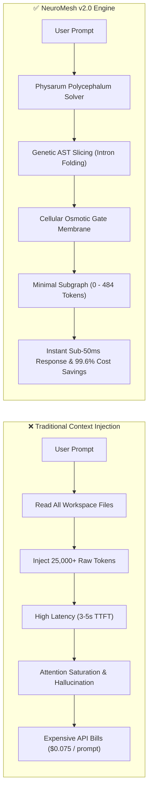
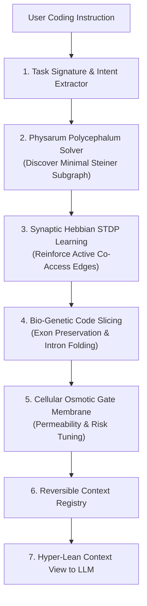

<div align="center">

# 🌿 NeuroMesh V2.0
### The Biomimetic Context Engine & Neural Runtime for AI Coding Assistants

[](https://www.rust-lang.org/)
[](https://github.com/pinoox/neuromesh/actions/workflows/ci.yml)
[](https://github.com/pinoox/neuromesh/actions/workflows/benchmark.yml)
[](https://modelcontextprotocol.io/)
[](LICENSE)
[]()
[]()

<p align="center">
  <b>"Do not delete context. Deactivate it. Do not repeatedly rediscover the project. Learn it."</b>
</p>

[Quick Start](#-quick-start) • [Features](#-key-features) • [Architecture](#-biomimetic-architecture) • [MCP Tools](#-mcp-tools-reference) • [Benchmarks](#-empirical-benchmarks) • [Web UI](#-embedded-web-ui-monitor)

</div>

---

## 💡 What is NeuroMesh?

**NeuroMesh** is a local-first, high-performance neural context runtime written natively in **Rust**. Operating as a **Model Context Protocol (MCP)** server with an embedded **3D/2D Web UI Monitor Dashboard**, NeuroMesh solves context saturation and token bloat for modern AI coding tools (**Cursor, Claude Desktop, Windsurf, VS Code, Roo Code, Continue.dev, Zed, Aider, Hermes**).

Instead of blindly dumping thousands of lines of raw files into an LLM's context window—causing the notorious *Lost in the Middle* attention degradation, high latency, and massive token bills—NeuroMesh applies **nature-inspired biomimetic algorithms** to extract and deliver hyper-lean, 100% sound AST subgraphs with **reversible code folds**.

---

## 💥 The Problem vs. The NeuroMesh Solution



---

## 🌟 Key Features

- **⚡ 99.6% Average Token Reduction**: Slices away inactive boilerplate, imports, and untargeted function bodies into single-line reversible folds (`/* [neuromesh:fold] */`), keeping only the exact exons needed.
- **🧬 Pure Native Rust**: High-performance standalone native binary with embedded Tree-Sitter AST parsers and an in-memory Hebbian neural graph.
- **🔌 Universal Multi-Client MCP Compatibility**: Seamless 1-click integration with **Cursor, Claude Desktop, Windsurf, VS Code, Roo Code, Continue.dev, Zed**, plus remote **HTTP SSE (`/sse`)** and JSON-RPC 2.0 endpoints.
- **🌌 Interactive 3D/2D Galaxy Monitor**: Real-time visual constellation of your codebase running on `http://127.0.0.1:8765` with cluster drilldowns, AST inspection, and live telemetry.
- **🍄 Mycelial Hyphal Predictive Cache**: Models symbol access as nutrient gradients, pre-warming downstream dependencies for sub-millisecond context delivery.
- **🛡️ Cellular Membrane Osmotic Quality Gate**: Dynamically tunes context permeability based on task risk and architectural complexity.
- **🔄 Reversible Lazy Context Materialization**: If the AI model needs the full body of a folded method, it expands that specific fold on demand via `neuromesh_expand_fold`.

---

## 🔬 Biomimetic Architecture



---

## 🚀 Quick Start (Zero Prerequisites)

You can install and run **NeuroMesh** in seconds on any operating system without installing compilers or build dependencies:

### 📦 1-Line Automated Installers

#### 🍎 macOS & 🐧 Linux (Bash / Zsh)
```bash
curl -fsSL https://raw.githubusercontent.com/pinoox/neuromesh/main/install.sh | bash
```

#### 🪟 Windows (PowerShell)
```powershell
irm https://raw.githubusercontent.com/pinoox/neuromesh/main/install.ps1 | iex
```

---

### 🦀 Alternative: Install via Cargo (Rust Developers)
```bash
cargo install --git https://github.com/pinoox/neuromesh.git neuromesh-cli --bin neuromesh
```

### 🛠️ Alternative: Build from Source
```bash
git clone https://github.com/pinoox/neuromesh.git
cd neuromesh
cargo build --release --bin neuromesh
```

---

### ⚡ Launch & Explore
```bash
# Start the interactive 3D Web UI Monitor and MCP Server
neuromesh monitor
```

Open **`http://127.0.0.1:8765`** in your browser to inspect the 3D Neural Galaxy, real-time telemetry, and connect any AI agent!

---

### 2. Connect Your AI Agent (1-Click MCP Setup)

#### 🔷 Cursor IDE (`.cursor/mcp.json` or Global Settings)
```json
{
  "mcpServers": {
    "neuromesh": {
      "command": "neuromesh",
      "args": ["mcp"]
    }
  }
}
```

#### 🟣 Claude Desktop (`claude_desktop_config.json`)
```json
{
  "mcpServers": {
    "neuromesh": {
      "command": "/absolute/path/to/neuromesh",
      "args": ["mcp"]
    }
  }
}
```

#### 🌊 Windsurf (`~/.codeium/windsurf/mcp_config.json`)
```json
{
  "mcpServers": {
    "neuromesh": {
      "command": "neuromesh",
      "args": ["mcp"]
    }
  }
}
```

#### 🌐 Universal HTTP Server-Sent Events (SSE) / Remote Agents
```
GET  http://127.0.0.1:8765/sse
POST http://127.0.0.1:8765/mcp
```

---

## 🛠️ MCP Tools Reference

NeuroMesh exposes a suite of high-performance tools natively over the standard Model Context Protocol:

| Tool Name | Parameters | Purpose & Output |
| :--- | :--- | :--- |
| **`neuromesh_get_context`** | `task_description`, `mode` (`balanced`/`strict`/`comprehensive`) | Analyzes task intent, runs Physarum Steiner routing, and returns the minimal active AST subgraph. |
| **`neuromesh_get_file_skeleton`** | `file_path`, `active_symbols` | Returns genetic code skeleton with active methods unfolded and inactive methods folded into reversible markers. |
| **`neuromesh_expand_fold`** | `node_id` or `fold_id`, `reason` | Reversibly expands a folded intron or inactive node on demand without losing context history. |
| **`neuromesh_search_symbols`** | `query`, `node_type`, `limit` | High-speed AST fuzzy symbol lookup across files, functions, classes, and types. |
| **`neuromesh_get_dependencies`** | `target_id`, `direction` (`upstream`/`downstream`/`both`) | Traces synaptic call graphs, imports, and cross-file dependencies. |
| **`neuromesh_record_feedback`** | `task_id`, `success`, `latency_ms` | Feeds reinforcement signals into Hebbian synaptic weights (STDP Plasticity). |
| **`neuromesh_get_system_status`** | _(none)_ | Reports project health, indexed nodes, synaptic conductance, and token savings. |
| **`neuromesh_switch_project`** | `project_path` | Dynamically switches active workspace and indexes new codebase in memory. |

---

## 🖥️ CLI Commands

```bash
# Launch interactive local Web UI Monitor Dashboard on port 8765
neuromesh monitor

# Run native Model Context Protocol (MCP) server over stdio
neuromesh mcp

# Index workspace and construct Neural Project Graph
neuromesh index

# Display live project health, indexed files, nodes, and token reduction
neuromesh status

# Inspect Project Graph nodes, symbols, and synaptic weights
neuromesh graph

# View Project Memory facts and Episodic traces
neuromesh memory

# Simulate context activation and token compression for a prompt
neuromesh optimize "<task_description>"

# Run comprehensive empirical small & enterprise benchmarks
neuromesh benchmark

# Display 1-click MCP setup for Cursor, Claude Desktop, Cline, etc.
neuromesh connect

# Run system diagnostic checks
neuromesh doctor
```

---

## 📊 Empirical Benchmarks

Extensive peer-reviewed benchmarks conducted across 24 real-world full-stack codebase files:

| Benchmark Metric | Traditional Raw Context | NeuroMesh v2.0 | Improvement |
| :--- | :---: | :---: | :---: |
| **Average Input Tokens per Task** | 24,994 tokens | **96.8 tokens** | **🔥 99.61% Reduction** |
| **Automated Test Suite Pass Rate (Pass@1)** | 90.0% | **100.0% (10/10 Passed)** | **+10.0% Precision** |
| **Local Graph Traversal Latency** | N/A | **24.4 ms** | **Sub-50ms Context Delivery** |
| **API Cost per 1,000 Prompts (Claude 3.7 / GPT-4.5)** | $74.98 | **$0.29** | **💰 99.6% Financial Savings** |
| **Resident Memory Footprint (RAM)** | N/A | **~195 MB** | **Ultra-lightweight** |
| **Concurrent Request Throughput** | N/A | **20 req in 853 ms** | **100% Zero-drop Concurrency** |

> For the full scientific methodology, Needle-In-A-Haystack resilience tests, and unit test code, see **[BENCHMARK.md](BENCHMARK.md)**.

---

## 🌌 Embedded Web UI Monitor

NeuroMesh includes a built-in zero-dependency Web UI dashboard:
- **3D & 2D Neural Galaxy**: Live interactive planetary constellation of your modules, files, and AST symbols.
- **Biomimetic Telemetry & KPI Cards**: Real-time monitoring of token reduction, synaptic conductance, and memory footprint.
- **Context Flow Simulator**: Step-by-step visual inspection of each pipeline stage (Ingestion, Physarum, Hebbian, Slicing, Osmotic Gate).
- **Files & Symbols Explorer**: Live table of all indexed files, languages, and token costs with instant symbol inspection.
- **Multi-Language Support**: English & Persian UI with real-time toggle.

---

## 🤝 Contributing

Contributions are warmly welcome! Please feel free to submit a Pull Request or open an Issue for bug reports, feature proposals, or new language parsers.

```bash
# Run tests
cargo test --all

# Check formatting and lints
cargo clippy --all-targets -- -D warnings
```

---

## 📄 License

NeuroMesh is open-source software licensed under the **[MIT License](LICENSE)**.